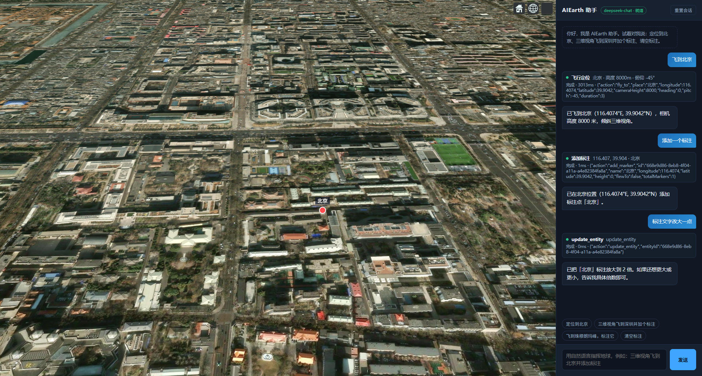

# AIEarth · 自然语言驱动的三维地球 Agent

用聊天的方式操作 Cesium：说一句「三维视角飞到北京并添加标注」，Agent 自己决定调什么工具，浏览器里的地球照做。

技术栈：**前端 Vite + TypeScript + Cesium**（ArcGIS 影像 / ArcGIS 高程） + **后端 Express + TypeScript + DeepSeek**（Function Calling 编排）。前后端分离，模型 Key 只留在服务端。

---

## 一、整体架构

```
┌──────────────────────── 浏览器 ────────────────────────┐
│  Cesium Viewer（ArcGIS 影像 + ArcGIS 高程）            │
│        ▲                                               │
│        │ 执行结果                   聊天面板（自然语言）│
│        │                                    │          │
│   命令总线 commands/                        │          │
│        ▲                                    ▼          │
└────────┼────────────────────────────────────┼──────────┘
         │ tool_calls（要做什么）              │ 用户消息
         │                                    │
┌────────┴──────────────── Node 服务端 ───────┴──────────┐
│  /api/chat  →  Agent Loop（多步决策 + 会话记忆）        │
│                 ├─ DeepSeek Function Calling（大脑）    │
│                 └─ 服务端工具：geo_locate 地名→坐标     │
└────────────────────────────────────────────────────────┘
```

**为什么工具在前端执行**：Cesium 实例、相机、Entity 都在浏览器里，服务端碰不到。
所以服务端只当「大脑」（编排 + 记忆 + 保管 Key），浏览器当「手脚」（真的动地球）。

一次完整往返：

1. 前端 `POST /api/chat {sessionId, message}`
2. 后端调 DeepSeek，模型返回 `tool_calls`（如 `fly_to`）
3. 后端原样把调用单回给前端（`type: 'tool_calls'`）
4. 前端命令总线执行 `fly_to`（Cesium `camera.flyTo`…）
5. 前端 `POST /api/chat {sessionId, toolResults}` 回传结果
6. 后端把结果喂回模型，模型给出最终中文回复（`type: 'final'`）

支持多工具串行、多轮回传，直到模型不再要工具为止。

## 二、目录结构

```
AIEarth/
├─ shared/                 # 前后端唯一契约
│  ├─ tools.ts             #   工具定义（JSON Schema + 执行位置 + 阶段）
│  └─ protocol.ts          #   消息协议 / 请求响应类型
├─ server/                 # Agent 服务端
│  ├─ src/
│  │  ├─ index.ts          #   Express 入口（8787）
│  │  ├─ config.ts         #   环境与模型配置
│  │  ├─ agent/
│  │  │  ├─ loop.ts        #   ★ Agent 主循环
│  │  │  ├─ llm.ts         #   DeepSeek（OpenAI 兼容）客户端
│  │  │  ├─ prompt.ts      #   System Prompt
│  │  │  └─ mock.ts        #   离线规则引擎（无 Key 时跑通链路）
│  │  ├─ session/          #   会话记忆与 TTL
│  │  ├─ tools/            #   服务端工具 + 内置地名词典
│  │  └─ routes/chat.ts    #   /api/chat /api/tools /api/geocode /api/health
│  └─ .env.example
└─ web/                    # 前端
   ├─ vite.config.ts       #   Cesium 静态资源拷贝 + /api 代理
   └─ src/
      ├─ cesium/viewer.ts          # Viewer 初始化（ArcGIS 影像 + 高程）
      ├─ cesium/commands/          # ★ 命令总线与执行器（flyTo / 标注 / 清空）
      ├─ ui/chat.ts                # 聊天面板与工具执行状态
      └─ api/client.ts             # 后端接口
```

## 三、快速开始

```bash
# 1) 安装依赖（根 workspaces 一次装完前后端）
npm install

# 2) 配置模型
cp server/.env.example server/.env
#   填入 DEEPSEEK_API_KEY=sk-xxxx
#   没有 Key 也能跑：把 MOCK_LLM 设为 true，用离线规则模式验证链路

# 3) 启动（两个进程：后端 8787 / 前端 5173）
npm run dev
#   或分别启动：
#   npm run dev:server
#   npm run dev:web

# 4) 打开 http://localhost:5173
```

启动后主界面如下：



生产形态：`npm run build` 产出 `web/dist`，后端会自动托管它，直接访问 `http://localhost:8787`。

### 停止服务

在启动服务的终端里按两次 `Ctrl+C`。若端口仍被占用（`Ctrl+C` 只结束了 npm 包装进程，真正的 node 服务进程可能残留），手动清掉：

```bash
# 找到占用端口的 PID（看最后一列）
netstat -ano | grep -E "LISTENING" | grep -E ":(5173|8787)"

# 强制结束（把 16852 换成上面查到的 PID）
taskkill //PID 16852 //F

# 复验：都应返回 000（连不上）
curl -s -m 4 -o /dev/null -w "%{http_code}\n" http://127.0.0.1:8787/api/health
curl -s -m 4 -o /dev/null -w "%{http_code}\n" http://127.0.0.1:5173/
```

### 启动常见故障

| 现象 | 原因 | 处理 |
| --- | --- | --- |
| Vite 卡在删除 `node_modules/.vite` | 安全软件/沙箱拦截了删除 | 把该目录改名（`mv web/node_modules/.vite web/node_modules/.vite-bak`）再启动 |
| 页面报 `Unexpected token '<'` / Worker MIME 类型错误 | dev 下 `/cesium/**` 没被服务，fallback 成 `index.html` | `web/vite.config.ts` 里的 `cesiumDevStatic()` 插件负责托管，确认它没被删 |
| 后端起不来 | 端口 8787 被上次残留进程占了 | 按上面的停止步骤清端口 |

## 四、已实现的能力（32 个工具）

### 核心 core
| 工具 | 位置 | 说明 |
| --- | --- | --- |
| `fly_to` | 浏览器 | `camera.flyTo`，支持地名/经纬度、高度、heading/pitch/roll、时长 |
| `add_marker` | 浏览器 | 添加 Entity 标注（点 + 文字标签），可带颜色、描述、添加后自动飞过去 |
| `clear_markers` | 浏览器 | 清空全部标注 |
| `geo_locate` | 服务端 | 内置地名词典（中国省市 + 世界主要城市 + 知名地标） |

### 数据加载 data
| 工具 | 说明 |
| --- | --- |
| `load_geojson` | GeoJSON（url 或内联 data），支持颜色/透明度/线宽/贴地/属性标注 |
| `load_kml` | KML/KMZ（KMZ 仅支持 url） |
| `load_czml` | CZML 时序数据 |
| `load_3dtiles` | 3D Tiles（url 或 Ion 资产），支持精度与高度偏移 |
| `load_imagery` | 影像服务 WMS / WMTS / XYZ / ArcGIS MapServer |
| `load_terrain` | 切换地形：flat / arcgis / 自定义 url |

### 图层与底图 layer
`list_layers`、`remove_layer`、`set_layer_visibility`、`clear_scene`、`set_basemap`（暗色/卫星/OSM/天地图/高德/自定义 XYZ）

### 图形实体 draw
`add_polyline`、`add_polygon`（可拉伸）、`add_model`（glTF/GLB）、`add_billboard`、`update_entity`、`remove_entity`、`query_entities`

### 相机视角 camera
`set_view`、`get_view`、`zoom_to_extent`、`look_at_transform`、`start_orbit`、`stop_orbit`

### 场景环境 scene
`set_scene_options`（雾/大气/阴影/日月/背景色）、`set_globe_lighting`

### 量测与输出 analysis
`measure`（距离/面积，测地距离 + 球面积分）、`screenshot`

试试这些话：

- 定位到北京
- 三维视角飞到深圳并加个标注
- 加载这个 GeoJSON 文件
- 叠加一个 WMS 影像服务
- 画一条从北京到上海的线，量一下多长
- 换成暗色底图 / 打开雾效和阴影
- 把那个图层隐藏掉
- 截个图

> 离线规则模式（无 Key）也能响应其中一批简单指令：截图、当前视角、图层列表、换底图、环绕、雾效/阴影/光照、地形切换。

## 四·B、两层「按需加载」设计

工具一多，模型的选择准确率会明显下降；知识一多，上下文会爆。所以这里做了两层路由：

1. **工具意图路由**（`shared/tools.ts` → `getToolsForIntent`）：
   按用户输入的关键词把工具分成 `core/data/layer/draw/camera/scene/analysis` 七组，
   每次只下发「core + 命中的分组」（最多 3 组），通常 6~13 个工具；无法判断意图时才全量下发。
2. **领域知识路由**（`server/src/agent/knowledge/index.ts`）：
   14 个官方 CesiumJS 领域文档共约 300KB，**不进 system prompt**，
   按意图打分后只注入 Top-2 领域的开头片段（约 4~8K 字符）——
   文档开头正是该领域最容易踩坑的规则（如经度在前、西半球为负、加载后要 zoomTo 框住）。

## 五、怎么扩充新能力（以「加载 GeoJSON」为例）

三步，不用动 Agent 主流程：

1. **定义工具**：在 `shared/tools.ts` 里新增一项，`target: 'client'`，`stage: 'mvp'`，指定 `group`，写好 JSON Schema 与描述。
2. **前端实现**：在 `web/src/cesium/commands/` 下写执行器，返回 `{ ok, data }`，并在 `register.ts` 里 `registerCommand('load_data', …)`。
3. **完事**：后端会自动把新工具下发给模型，前端命令总线按名字分发。

服务端能力（比如接数据库、接高德/天地图 API）则在 `server/src/tools/serverTools.ts` 里加 case，`target: 'server'` 的工具由后端就地执行，模型立刻能看到结果。

第二批（`stage: 'planned'`，已在契约里占位）：`play_trajectory`、`control_clock`、`add_heatmap`、`save_viewpoint`/`load_viewpoint`、`highlight`、`terrain_analysis`、`feature_extract`、`stat_query`。

## 五·B、回归测试

```bash
node scripts/check-routing.ts      # 知识库加载 + 工具意图路由（不开浏览器）
node scripts/check-llm-config.ts   # 多厂商 LLM 配置解析校验
node scripts/e2e-commands.mjs      # 真实浏览器跑 31 个命令（需前端已启动）
node scripts/e2e-chat.mjs          # 端到端聊天链路（飞行 + 标注）
node scripts/e2e-thinking.mjs     # 发送后的等待状态气泡（设 DELAY_MS=7500 测慢提示）
node scripts/e2e-protocol.mjs     # tool_calls 协议一致性（假模型服务，不需要真 Key）
```

`e2e-protocol.mjs` 会起一个「假 OpenAI 服务」，按 DeepSeek 的规则校验发给模型的 messages，
再用脚本化的模型回复驱动真实后端，覆盖 12 种时序：工具结果没回传、部分回传、重复回传、
跨轮旧结果、并发、混排顺序、长会话等。**改 Agent 主循环后务必跑它**。

## 六、配置说明

### 换 LLM 服务商

所有厂商都走 **OpenAI 兼容协议**，SDK 层零改动，只改环境变量：

```bash
# server/.env
LLM_PROVIDER=qwen              # deepseek|openai|qwen|moonshot|glm|siliconflow|ollama|custom
DASHSCOPE_API_KEY=sk-xxxx      # 各家自己的 Key 变量名，见下表
```

不填 `LLM_PROVIDER` 也行——会按你配了哪个 Key 自动推断。别名也认：`aliyun`/`dashscope`/`tongyi`→qwen、`kimi`→moonshot、`zhipu`/`chatglm`→glm、`gpt`→openai、`local`→ollama。

| provider | 厂商 | 默认模型 | 接口地址 | Key 环境变量 |
| --- | --- | --- | --- | --- |
| `deepseek` | DeepSeek | `deepseek-chat` | `https://api.deepseek.com` | `DEEPSEEK_API_KEY` |
| `openai` | OpenAI | `gpt-4o-mini` | `https://api.openai.com/v1` | `OPENAI_API_KEY` |
| `qwen` | 通义千问 | `qwen-plus` | `https://dashscope.aliyuncs.com/compatible-mode/v1` | `DASHSCOPE_API_KEY` / `QWEN_API_KEY` |
| `moonshot` | Moonshot (Kimi) | `moonshot-v1-8k` | `https://api.moonshot.cn/v1` | `MOONSHOT_API_KEY` |
| `glm` | 智谱 GLM | `glm-4-flash` | `https://open.bigmodel.cn/api/paas/v4` | `ZHIPU_API_KEY` / `GLM_API_KEY` |
| `siliconflow` | 硅基流动 | `Qwen/Qwen2.5-7B-Instruct` | `https://api.siliconflow.cn/v1` | `SILICONFLOW_API_KEY` |
| `ollama` | Ollama 本地 | `qwen2.5:7b` | `http://localhost:11434/v1` | 无需 Key |
| `custom` | 自建/网关 | 必填 | 必填 | `LLM_API_KEY` |

想用列表外的服务（自建网关、vLLM、One-API、中转站等），用通用三件套覆盖即可，它会盖掉厂商默认值：

```bash
LLM_BASE_URL=https://my-gateway.example.com/v1
LLM_MODEL=Qwen2.5-72B-Instruct
LLM_API_KEY=sk-xxxx
```

> **选型提醒**：本项目的一切能力都建立在 **function calling** 上，模型必须支持工具调用。
> 已知不支持的：`deepseek-reasoner`、多数本地小模型（Ollama 需装 `qwen2.5` / `llama3.1` 这类支持 function calling 的版本）。

查当前生效的配置：`npx tsx scripts/check-llm-config.ts`（会打印解析结果 + 全部厂商预设表）。

### 全部环境变量

| 变量 | 默认 | 说明 |
| --- | --- | --- |
| `LLM_PROVIDER` | `deepseek` | 服务商，见上表；不填会按已配置的 Key 自动推断 |
| `LLM_BASE_URL` / `LLM_MODEL` / `LLM_API_KEY` | - | 通用三件套，优先级高于厂商默认值，接自建网关用这个 |
| `LLM_TEMPERATURE` | `0.2` | 工具调用场景建议低温 |
| `LLM_MAX_TOKENS` | `2048` | - |
| `MOCK_LLM` | `false` | `true` 时用离线规则引擎，不联网也能跑通链路 |
| `LLM_FALLBACK_TO_MOCK` | `false` | 真实模型调用失败时自动降级到规则引擎（回复里会标注「本次由离线规则兜底」，不假装是模型干的） |
| `PORT` | `8787` | 后端端口 |
| `AGENT_MAX_STEPS` | `6` | 单轮最多决策几步，防止死循环 |
| `AGENT_MAX_HISTORY` | `40` | 会话保留的消息条数 |

## 六·B、模型调用失败时会发生什么

模型侧的故障不会让整个 turn 崩掉，会翻译成用户能看懂的提示：

| 情况 | HTTP | 界面提示 |
| --- | --- | --- |
| 余额不足（402） | 402 | 提示去服务商控制台充值，或设 `MOCK_LLM=true` 继续验证 |
| Key 无效（401/403） | 401 | 提示检查 `server/.env` 里对应的 Key 变量 |
| 限流（429） | 429 | 提示稍后再试 |
| 网络不通 / 超时 | 502 | 提示检查网络与代理（注意 `HTTP_PROXY` 可能指向无效代理），会带上实际接口地址 |
| 服务端 5xx | 502 | 提示稍后重试 |

提示语里的厂商名、Key 变量名、接口地址都会跟着 `LLM_PROVIDER` 变，不会出现「用着千问却提示去 DeepSeek 充值」。

想让服务在模型挂掉时**继续干活**，把 `LLM_FALLBACK_TO_MOCK` 设为 `true`：会用离线规则引擎兜底执行命令，并在回复里明确标注本次不是模型真实理解的结果。

## 七、已知边界

- 底图/地形走 ArcGIS 在线服务，国内网络不通时影像会空白、地形会自动回退到椭球体（控制台有日志）。
- 地名词典是内置的精简版，冷门地名查不到时模型会用自己的地理知识给近似坐标（回复里会说明）。后续可换成高德/天地图 Web 服务（在 `server/src/tools/geo.ts` 里替换实现即可）。
- 未使用 Cesium ion，不需要 ion token。
